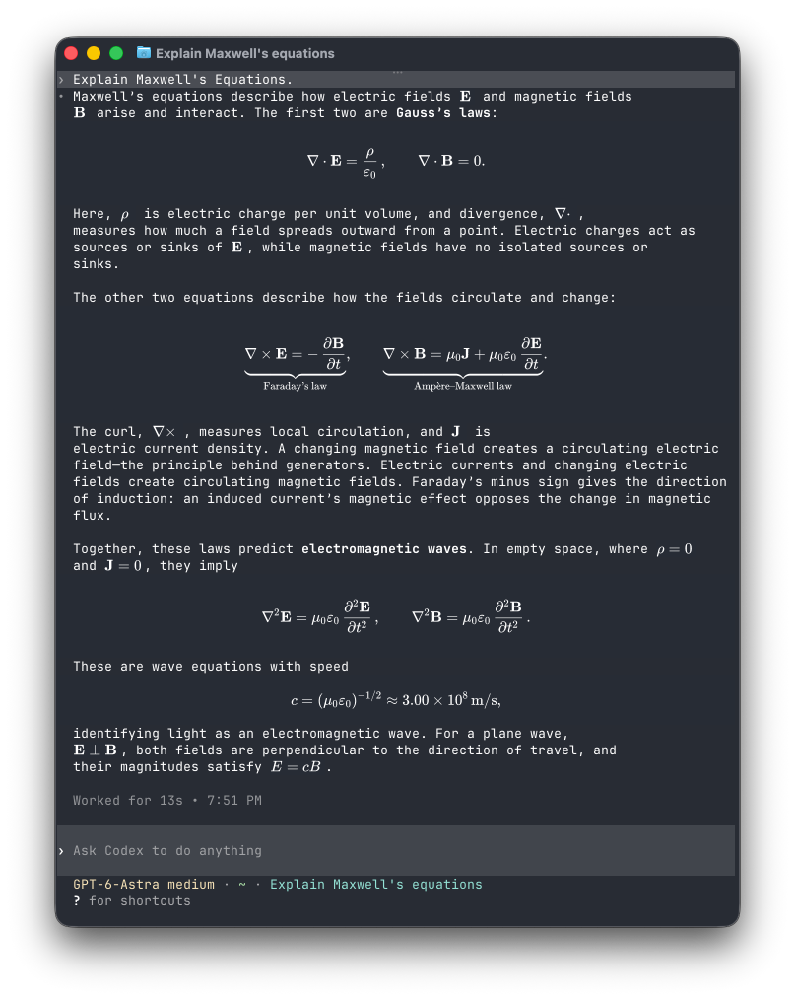

<p align="center">
  
</p>
<h1 align="center">TermiTex</h1>
<p align="center"><strong>Beautiful math, right in your terminal.</strong></p>
<p align="center">A Rust math renderer for live CLI output. Built for stock Codex in Ghostty.</p>
<p align="center">
  <a href="LICENSE"></a>
  
</p>
<p align="center">
  <a href="#quick-start">Quick start</a> ·
  <a href="#performance">Performance</a> ·
  <a href="#comparison">Comparison</a> ·
  <a href="#configuration">Configuration</a> ·
  <a href="#contributing">Contributing</a>
</p>

Read equations where you work. TermiTex turns LaTeX in CLI output into beautifully typeset math, with native Rust rendering and equations that follow the conversation as you scroll. Launch it with one command—no custom Codex build.

- **Native by default.** RaTeX renders with embedded math fonts; no Node.js or TFormula runtime required.
- **Rendering stays off the input loop.** Cached equations move without being typeset again.
- **Two layouts.** Compact math with native prose for Codex, or centered overlays that preserve source cells.
- **Optional MathJax.** Select it for its appearance or extensions such as physics `\dv`.

<p align="center">
  
</p>
<p align="center"><em>Maxwell’s equations, rendered directly in Codex CLI.</em></p>

## Quick start

On macOS, with [Homebrew](https://brew.sh), Ghostty, and Codex CLI installed:

```sh
brew install tingkai-c/tap/termitex
termitex
```

Homebrew handles the build and dependencies through our [official tap](https://github.com/tingkai-c/homebrew-tap). No Node or npm needed.

To update later:

```sh
brew update
brew upgrade termitex
```

<details>
<summary>Build from source instead</summary>

Requires Git and a recent Rust toolchain (tested with 1.95).

```sh
git clone https://github.com/tingkai-c/TermiTex.git
cd TermiTex
cargo build --release --locked
./target/release/termitex
```

</details>

The default command launches `codex -c tui.rendering.math=false`. To pass your own Codex options:

```sh
termitex -- codex -c tui.rendering.math=false --model MODEL
```

For another interactive program, opt into compatibility mode:

```sh
termitex --layout compatibility -- your-program
```

## Performance

**TermiTex vs TFormula on the same headless terminal workload.** Each trial renders 12 equations, then repeats them.

| Metric · median across 5 trials | TermiTex 0.1.0 · native, compatibility mode | TFormula 0.3.1 · default settings |
| :--- | ---: | ---: |
| Launch → first image placement | **18.57 ms** | 361.11 ms |
| New equation → placement, after first render | **5.19 ms** | 203.85 ms |
| Repeated equation → placement | **0.49 ms** | 196.75 ms |
| Peak sampled process-tree RSS | **20.88 MiB** | 184.22 MiB |
| Cases producing validated PNG placements per trial | 24 / 24 | 24 / 24 |

[Methodology, scope & reproduction](benchmarks/competitors/README.md) · [Raw results](benchmarks/competitors/results.jsonl)

## Comparison

Choose the workflow that fits your terminal.

| Tool | Workflow | Renderer |
| :--- | :--- | :--- |
| **TermiTex** | Live CLI math; compact layout or centered, source-preserving overlays | Native RaTeX by default; optional MathJax |
| [**TFormula**](https://github.com/mikewang817/TFormula#tformula) | Live agent overlays and a document reader | MathJax |
| [**TXM**](https://github.com/thatmagicalcat/txm#txm) | Expression rendering and library/editor integration | Rust rendering engine |

[Full comparison](docs/comparison.md)

## Configuration

Create `~/.config/termitex/config.toml` (or `$XDG_CONFIG_HOME/termitex/config.toml`):

```toml
renderer = "ratex" # "ratex" or "mathjax"
layout = "compact" # "compact" or "compatibility"
```

| Setting | Default | Override |
| :--- | :--- | :--- |
| Renderer | `ratex` | `--renderer mathjax` or `TERMITEX_RENDERER=mathjax` |
| Layout | `compact` | `--layout compatibility` or `TERMITEX_LAYOUT=compatibility` |
| Foreground / background | `#ffffff` / `#282c34` | `TERMITEX_FG` / `TERMITEX_BG` |
| Statistics file | Disabled | `TERMITEX_STATS=/tmp/termitex-stats.json` |

Precedence: **CLI > environment > config > default**. Options after `--`, or after the child command starts, belong to that program. See [config.example.toml](config.example.toml).

### Choose a layout

| Behavior | Compact (default) | Compatibility (opt-in) |
| :--- | :--- | :--- |
| Inline math | Fits rendered width; surrounding prose moves left | Centered horizontally in the original source span; text baseline retained |
| Display math | Centered in its detected block | Centered in its detected block |
| Underlying terminal text | Projected cells replace visible source | Original source cells remain intact |
| Wrapped inline formulas | Joined when fully visible, up to nine source rows | Left as source to avoid covering neighboring prose |
| Intended use | Codex in Ghostty | Preserving source text and coordinates |

### Use MathJax

The Homebrew package includes the native renderer only. For MathJax, use the source-build instructions above, keep the checkout, and install Node.js 20+. From that checkout:

```sh
npm ci --ignore-scripts
./target/release/termitex --renderer mathjax
```

Choose RaTeX for native rendering or MathJax for its appearance and extensions. [Renderer details](docs/reference.md).

## Documentation

[Rendering & compatibility](docs/reference.md) · [Benchmarks](benchmarks/competitors/README.md) · [Example configuration](config.example.toml)

## Contributing

Bug reports are most useful with the terminal and OS versions, backend/layout, a minimal formula or redraw sequence, and expected versus actual output. [Open an issue](https://github.com/tingkai-c/TermiTex/issues).

```sh
cargo test --locked
cargo fmt --check
```

The Rust tests cover detection, layout, configuration, worker recovery, and headless PTY scrolling/resizing. Native image checks exercise 31 representative renders and five invalid/unsupported inputs; compatibility checks verify centering. No Python or Pillow is needed for tests. Historical benchmark scripts still use Python.

After installing npm dependencies, also run:

```sh
cargo test --locked --test workers mathjax -- --ignored
cargo test --locked --test pty mathjax -- --ignored
node tests/backend_pixels.mjs
node tests/cache.mjs
```

Set `TERMITEX_TEST_ARTIFACTS=/tmp/termitex-qa` to save PNGs and source requests for inspection.

## License and acknowledgments

TermiTex is [MIT licensed](LICENSE). Native rendering uses [RaTeX](https://github.com/erweixin/RaTeX), pinned to `776c1d37bafa3bf445a0ab9377c55fe77f7a0133`; font notices are in [licenses/](licenses/). Include these notices when redistributing the native binary.

Inspired by [TFormula](https://github.com/mikewang817/TFormula), by Mike Wang. Small MathJax geometry, SVG-dimension, and TeX-compatibility helpers were adapted under MIT; see [the retained notice](worker/TFORMULA-LICENSE). No TFormula package, process, configuration, or cache is used. MathJax/resvg retain their own licenses.
