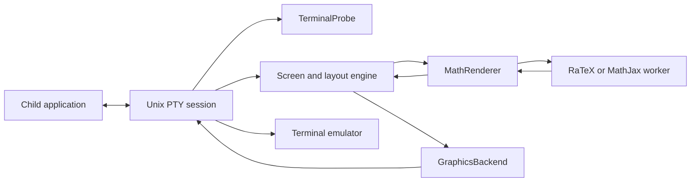

# Architecture

TermiTex separates terminal transport from math rendering and document layout. The first graphics implementation serves Ghostty, Kitty, WezTerm, iTerm2, and Konsole through their Kitty graphics implementations. Terminal names are diagnostic information, not branches in the layout engine.

## Interfaces

- `TerminalProbe` produces queries, consumes replies, reports capabilities, and returns unrelated user input. `KittyProbe` checks graphics transport, pixel cell size, and synchronized updates. Probing has a 200 ms deadline and a 64 KiB input bound. Environment variables identify the terminal for reports; they do not enable graphics.
- `GraphicsBackend` encodes upload, placement, removal, release, and cleanup operations. It returns commands rather than writing to stdout. `KittyGraphics` is the shared implementation. Layout supplies rectangles and image identifiers; it never constructs graphics escape sequences.
- `MathRenderer` exposes nonblocking submission and polling plus worker shutdown. `WorkerRenderer` owns an isolated renderer process and a bounded request channel. The I/O thread can wait for a response without blocking terminal input. Tests substitute `ChannelRenderer`.

The session is the composition root: it chooses implementations and owns terminal I/O ordering, raw-mode restoration, resizing, signals, and the child exit code. The engine owns detection, compact/compatibility layout, placement reconciliation, and the image cache. Renderer request/response types live in `renderer.rs`; neither typesetting backend knows which terminal will display its output.

## Capability policy

Auto mode enables graphics only after an affirmative Kitty query reply. Unsupported or silent terminals receive the child's original output without starting a math worker or projecting text. `--graphics kitty` explicitly forces the existing transport when probing is unavailable; `--graphics off` bypasses probing and graphics altogether.

Synchronized updates are used only when the terminal reports support. Child-generated terminal controls are still passed through. Successful transport negotiation is not proof of complete graphics conformance or visual scrolling quality.

Keep terminal-specific workarounds inside the transport/probe layer and add them only for a reproduced, versioned failure. There are no speculative brand-specific workarounds. A future Sixel backend must first account for its different image lifetime and redraw semantics; the current interface is not a promise that every protocol maps identically.

Application heuristics (such as the Codex input-area exclusion) remain in detection. Compact and compatibility modes remain layout choices independent of terminal brand. The existing layout algorithm and renderer geometry are unchanged by this refactor.

## Validation

Unit tests cover split/reordered replies, unrelated input preservation, layout, caching, and worker delays. PTY tests exercise negotiation, unsupported-terminal passthrough, exit codes, terminal restoration, rendering, scrolling redraws, and resizing. CI builds native binaries for macOS and Linux on x86-64 and ARM64, and launches Kitty/Konsole in Xvfb for protocol smoke tests. Actual visual behavior is tracked separately in [terminal compatibility](terminals.md).
