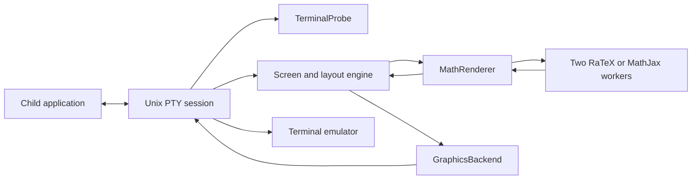

# Architecture

TermiTex separates terminal transport from math rendering and document layout. The first graphics implementation serves Ghostty, Kitty, WezTerm, iTerm2, and Konsole through their Kitty graphics implementations. Terminal names are diagnostic information, not branches in the layout engine.

## Interfaces

- `TerminalProbe` produces queries, consumes replies, reports capabilities, and returns unrelated user input. `KittyProbe` checks graphics transport, pixel cell size, default foreground/background colors, and synchronized updates. Probing has a 500 ms deadline and a 64 KiB input bound. Environment variables identify the terminal for reports; they do not enable graphics.
- `GraphicsBackend` encodes upload, placement, removal, release, and cleanup operations. It returns commands rather than writing to stdout. `KittyGraphics` is the shared implementation. Layout supplies rectangles and image identifiers; it never constructs graphics escape sequences.
- `MathRenderer` exposes nonblocking submission, completion polling, capacity, a completion notification descriptor, and shutdown. `RenderPool` owns two isolated `WorkerRenderer` processes, with one outstanding request per process. Their I/O threads notify a shared nonblocking Unix datagram socket after queuing a response, waking the session poll immediately. Tests substitute `ChannelRenderer`.

The engine tracks outstanding requests by cache key, so duplicate expressions share a render and out-of-order completions cannot clear another request. It drains ready results before one reconciliation, also folding ready results into incoming child-output updates. Completed child frames remain the boundary for painting; all terminal writes stay ordered on the session thread. There is no timer added to wait for a batch, no queue reprioritization, and no cancellation policy. Two processes increase renderer memory relative to one, especially for MathJax.

The session is the composition root: it chooses implementations and owns terminal I/O ordering, raw-mode restoration, resizing, signals, and the child exit code. The engine owns detection, compact/compatibility layout, placement reconciliation, and the image cache. Renderer request/response types live in `renderer.rs`; neither typesetting backend knows which terminal will display its output.

## Capability policy

Auto mode enables graphics only after an affirmative Kitty query reply. Unsupported or silent terminals receive the child's original output without starting a math worker or projecting text. `--graphics kitty` explicitly forces the existing transport when probing is unavailable; `--graphics off` bypasses probing and graphics altogether.

Synchronized updates are used only when the terminal reports support. Child-generated terminal controls are still passed through. Successful transport negotiation is not proof of complete graphics conformance or visual scrolling quality.

Keep terminal-specific workarounds inside the transport/probe layer and add them only for a reproduced, versioned failure. There are no speculative brand-specific workarounds. A future Sixel backend must first account for its different image lifetime and redraw semantics; the current interface is not a promise that every protocol maps identically.

Application heuristics (such as the Codex input-area exclusion) remain in detection. Compact and compatibility modes remain layout choices independent of terminal brand. The existing layout algorithm and renderer geometry are unchanged by this refactor.

## Validation

Unit tests cover split/reordered replies, unrelated input preservation, layout, caching, and worker delays. PTY tests exercise negotiation, unsupported-terminal passthrough, exit codes, terminal restoration, rendering, scrolling redraws, and resizing. CI builds native binaries for macOS and Linux on x86-64 and ARM64, and launches Kitty/Konsole in Xvfb for protocol smoke tests. Actual visual behavior is tracked separately in [terminal compatibility](terminals.md).

## Rendering pipeline benchmark

Run `cargo run --release --example render_pipeline_bench`. This exercises actual native worker processes and completion descriptors with 24 uncached display equations after a warmup, seven fresh-pool trials per configuration. It compares simulated 4 ms polling against event-driven completion, then one versus two workers. It asserts successful unique responses and bounded completion waits; timings are observations, not CI thresholds.

Local macOS arm64 medians: 120.08 ms with one worker and simulated polling, 5.24 ms with one worker and wakeups, 2.81 ms with two workers and wakeups. This isolates scheduling and rendering; it excludes PTY parsing, terminal image upload, emulator display, and startup. It does not measure scrolling frame rate, CPU savings, or memory savings. The polling baseline simulates an idle terminal loop; real incoming terminal events can wake that loop sooner.

## Startup benchmark

Run `cargo run --release --example startup_bench -- target/release/termitex` after building the release binary. This measures process launch until a trivial child's `READY` marker reaches a headless PTY, using nine launches per case and synthetic immediate terminal replies. It does not measure Codex readiness or a real terminal's reply latency.

Local macOS arm64 medians: direct child 1.83 ms; graphics disabled 5.53 ms; graphics enabled with all replies 23.78 ms; graphics supported but color replies omitted 529.63 ms. The all-replies range was 6.21–36.19 ms, so startup has substantial variation. Missing replies exhaust the 500 ms negotiation deadline before the child is launched. Worker startup also precedes forwarding the child's first output. The benchmark does not change these startup policies.
